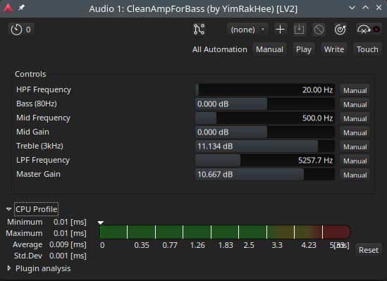

## CleanAmpForBass
high-performance, ultra-lightweight clean preamp LV2 plugin specifically designed for bass guitar. Built with pure C++20 and zero external dependencies, it offers an exceptionally low CPU footprint and zero latency.<br>
No GUI.<br>
Tested Environment: Arch Linux / Ardour.<br>



### Features
- 5-Band Precision EQ: Tailored frequency bands to sculpt the perfect bass tone.<br>
  HPF (High Pass Filter): Cleans up sub-bass mud and increases headroom.<br>
  Bass (80Hz): Low-shelf filter to add weight and punch.<br>
  Mid (Variable Freq): Peaking EQ to define the character and "growl" of the bass.<br>
  Treble (3kHz): High-shelf filter for fingerboard definition and slap snap.<br>
  LPF (Low Pass Filter): Tames harsh high-frequency fizz and noise.

- Optimized DSP Engine: Uses the Direct Form II Transposed biquad structure for maximum stability and efficiency.

### Requirements
- LV2 SDK
- C++20 compatible compiler (GCC/Clang)
- CMake

### Build & Install (LINUX)
```bash
# 1. Clone the repository
git clone https://github.com/YimRakHee/CleanAmpForBass.git
cd CleanAmpForBass

# 2. Create a build directory
mkdir build && cd build

# 3. Configure CMake and compile
cmake ..
make

# 4. Install the plugin (installs to ~/.lv2/ by default)
make install
```

